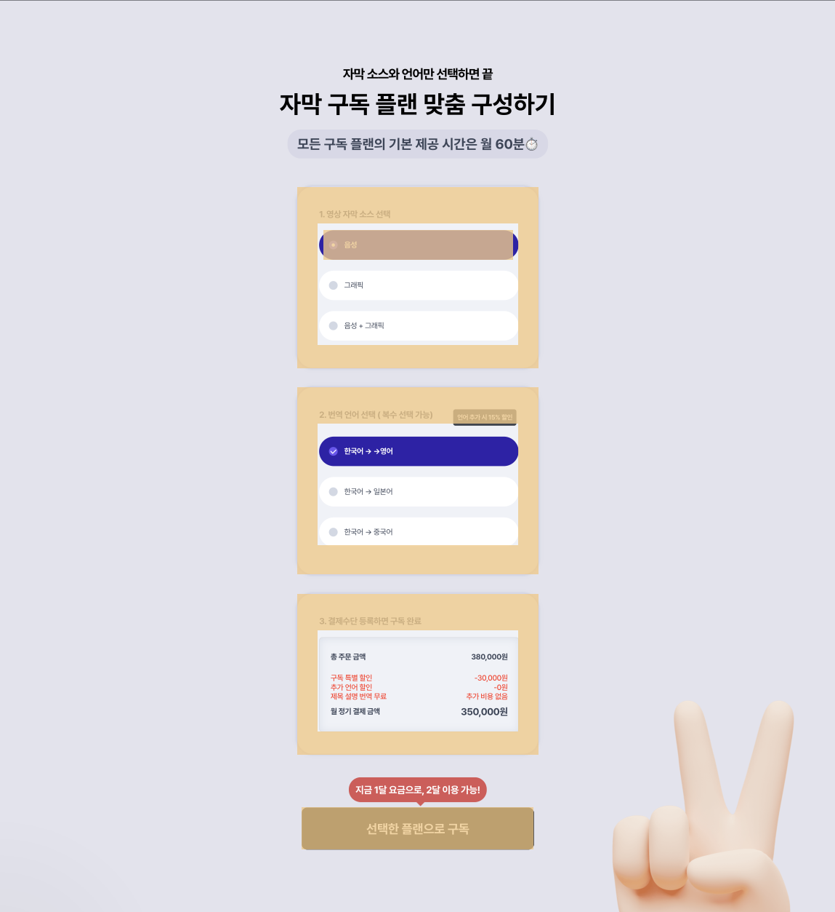

# DDD 방식으로 React 작업해보기

> 근데 이제 sticky와 grid를 곁들인

 

 

## 작업 기록

### 2차 : 마크업 컴포넌트로 만들기

- Radio
- ContentBox
- Button

 

### 1차 : 마크업 구조

- 목표: 디자인이나 화면 구성을 중심으로 마크업을 구성했다면 이번엔 각 컨텐츠의 의미를 중심으로 작업 진행해보기

 

 

## 디자인 및 페이지 참고

- [Jamake](https://jamake.io/ko/subscription)
